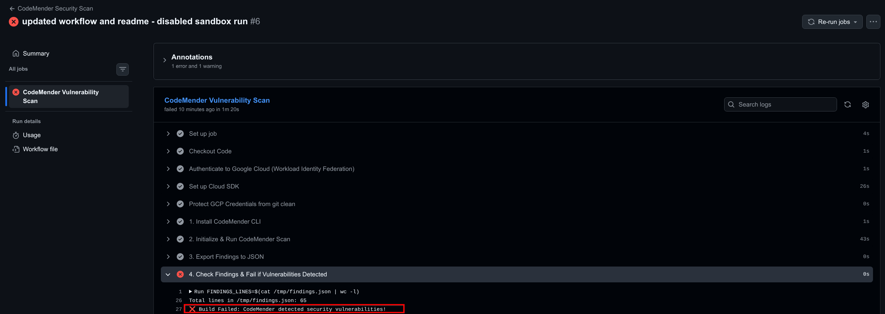

# Vulnerable Notes App

A deliberately vulnerable Flask lab application demonstrating common security vulnerabilities:
- **A05: Injection** - SQL Injection in Authentication
- **A01: Broken Access Control** - Insecure Direct Object Reference (IDOR) on note deletion
- **A05: Injection / XSS** - Stored Cross-Site Scripting (XSS) in note content rendering

## Running the Application

```bash
uv run python main.py
```

Access the web interface at `http://127.0.0.1:5000` (or `http://localhost:5000`).

## Seeded Accounts

The database initializes with the following demo credentials:
- `alice` / `alice123` (Role: user)
- `bob` / `bob123` (Role: user)
- `admin` / `adminpass` (Role: admin)

---

## Vulnerability Testing & Exploitation Guide

### Vulnerability 1: SQL Injection (Authentication Bypass)

- **Vulnerable Endpoint**: `POST /login`
- **Root Cause**: Raw string concatenation allows the SQL parser to interpret user input as logic operators.
- **Exploit Payload**:
  - **Username**: `admin' --`
  - **Password**: *(any value)*
- **Resulting Query**:
  ```sql
  SELECT * FROM users WHERE username = 'admin' --' AND password = '...'
  ```
  The `--` comments out the password clause entirely, authenticating you directly as the `admin` user without checking the password.

---

### Vulnerability 2: Insecure Direct Object Reference (IDOR / Broken Access Control)

- **Vulnerable Endpoint**: `GET /notes/delete?id=<note_id>`
- **Root Cause**: The endpoint checks authentication (is the user logged in?), but skips authorization (does this note belong to this user?).
- **Exploit Steps**:
  1. Log in as `alice` (`alice` / `alice123`, `user_id = 1`).
  2. Inspect the UI and note that Bob's note has `id = 2`.
  3. Navigate directly in your browser to:
     ```
     http://localhost:5000/notes/delete?id=2
     ```
  4. **Result**: Alice deletes Bob's private note despite not owning it.

---

### Vulnerability 3: Stored Cross-Site Scripting (XSS)

- **Vulnerable Endpoint**: `POST /notes/create` rendered via `{{ note.content | safe }}`
- **Root Cause**: Disabling Jinja's auto-escaping (`| safe`) causes raw browser-executable scripts stored in the database to execute in every visitor's browser session.
- **Exploit Payload**:
  1. Create a note with the following content:
     ```html
     <script>alert('Session Stolen: ' + document.cookie);</script>
     ```
  2. **Result**: Every time a user loads the home page, the JavaScript payload executes within their browser context.

---

## CI/CD Security Automation & Workload Identity Federation

<details>
<summary>🔑 <b>Google Cloud Workload Identity Federation (WIF) Setup for GitHub Actions</b></summary>

<br>

Follow these copy-pasteable commands in Google Cloud Shell or terminal to set up keyless Workload Identity Federation for GitHub Actions and grant the necessary permissions for CodeMender:

> [!IMPORTANT]
> **Prerequisites & Permissions:**
> - The account executing these setup commands must have the **Workload Identity Pool Admin** role (`roles/iam.workloadIdentityPoolAdmin`) or **Project Owner** (`roles/owner`) on the target Google Cloud project.
> - If this role was granted recently, allow **1–2 minutes** for Google Cloud IAM propagation across STS/IAM endpoints before creating the pool.

```bash
# -------------------------------------------------------------
# Configuration Variables (CUSTOMIZE THESE)
# -------------------------------------------------------------
export PROJECT_ID="your-gcp-project-id"
export SA_NAME="codemender-ci-sa"
export WORKLOAD_POOL="github-pool"
export WORKLOAD_PROVIDER="github-provider"
export GITHUB_REPO="your-github-username/notes-app" # e.g. "acme/notes-app"

# -------------------------------------------------------------
# 1. Set Active Project & Enable APIs
# -------------------------------------------------------------
gcloud config set project $PROJECT_ID
gcloud services enable \
    aiplatform.googleapis.com \
    iamcredentials.googleapis.com \
    iam.googleapis.com

# -------------------------------------------------------------
# 2. Create Service Account for GitHub Actions CI/CD
# -------------------------------------------------------------
gcloud iam service-accounts create $SA_NAME \
    --display-name="CodeMender CI/CD Service Account"

# -------------------------------------------------------------
# 3. Grant Vertex AI User Role (Required for CodeMender)
# -------------------------------------------------------------
gcloud projects add-iam-policy-binding $PROJECT_ID \
    --member="serviceAccount:${SA_NAME}@${PROJECT_ID}.iam.gserviceaccount.com" \
    --role="roles/aiplatform.user"

# -------------------------------------------------------------
# 4. Create Workload Identity Pool & OIDC Provider
# -------------------------------------------------------------
gcloud iam workload-identity-pools create $WORKLOAD_POOL \
    --location="global" \
    --display-name="GitHub Actions Pool"

gcloud iam workload-identity-pools providers create-oidc $WORKLOAD_PROVIDER \
    --location="global" \
    --workload-identity-pool=$WORKLOAD_POOL \
    --display-name="GitHub Provider" \
    --issuer-uri="https://token.actions.githubusercontent.com" \
    --attribute-mapping="google.subject=assertion.sub,attribute.actor=assertion.actor,attribute.repository=assertion.repository" \
    --attribute-condition="assertion.repository == '${GITHUB_REPO}'"

# -------------------------------------------------------------
# 5. Bind Service Account to GitHub Repository (Impersonation)
# -------------------------------------------------------------
export PROJECT_NUMBER=$(gcloud projects describe $PROJECT_ID --format="value(projectNumber)")

gcloud iam service-accounts add-iam-policy-binding \
    "${SA_NAME}@${PROJECT_ID}.iam.gserviceaccount.com" \
    --role="roles/iam.workloadIdentityUser" \
    --member="principalSet://iam.googleapis.com/projects/${PROJECT_NUMBER}/locations/global/workloadIdentityPools/${WORKLOAD_POOL}/attribute.repository/${GITHUB_REPO}"

# -------------------------------------------------------------
# 6. Output Required GitHub Repository Secrets
# -------------------------------------------------------------
echo "========================================================================="
echo "Copy the following key-value pairs into GitHub Repo -> Settings -> Secrets -> Actions:"
echo "========================================================================="
echo "GCP_PROJECT_ID:"
echo "${PROJECT_ID}"
echo ""
echo "GCP_SERVICE_ACCOUNT:"
echo "${SA_NAME}@${PROJECT_ID}.iam.gserviceaccount.com"
echo ""
echo "GCP_WORKLOAD_IDENTITY_PROVIDER:"
echo "projects/${PROJECT_NUMBER}/locations/global/workloadIdentityPools/${WORKLOAD_POOL}/providers/${WORKLOAD_PROVIDER}"
echo "========================================================================="
```

### How Workload Identity Federation Works Under the Hood
1. **GitHub OIDC Token**: GitHub Actions requests a signed OIDC JWT token containing repository claims (`repository`, `actor`, `ref`).
2. **Keyless Exchange**: The `google-github-actions/auth` step exchanges this JWT with the GCP Security Token Service (STS).
3. **Impersonation**: GCP verifies that the token's `assertion.repository` matches the bound repository policy and generates a short-lived (1 hour max) OAuth 2.0 access token for `${SA_NAME}@${PROJECT_ID}.iam.gserviceaccount.com`.
4. **No Static Keys**: Zero long-lived service account JSON keys to create, rotate, or leak.

</details>

<br>

<details>
<summary>🛡️ <b>GitHub Actions Workflow: CodeMender Security Gate (`.github/workflows/codemender.yml`)</b></summary>

<br>

This repository includes an automated security workflow located at [`.github/workflows/codemender.yml`](file:///.github/workflows/codemender.yml) that executes on every push and pull request:

```yaml
name: CodeMender Security Scan

on:
  push:
    branches: [ "main", "master" ]
  pull_request:
    branches: [ "main", "master" ]

jobs:
  security-scan:
    name: CodeMender Vulnerability Scan
    runs-on: ubuntu-latest

    permissions:
      contents: read
      id-token: write

    steps:
      - name: Checkout Code
        uses: actions/checkout@v4

      - name: Authenticate to Google Cloud (Workload Identity Federation)
        uses: google-github-actions/auth@v2
        with:
          workload_identity_provider: ${{ secrets.GCP_WORKLOAD_IDENTITY_PROVIDER }}
          service_account: ${{ secrets.GCP_SERVICE_ACCOUNT }}

      - name: Set up Cloud SDK
        uses: google-github-actions/setup-gcloud@v2

      - name: Protect GCP Credentials from git clean
        run: |
          # Copy the credentials file to the runner's temp directory outside the workspace
          cp "$GOOGLE_APPLICATION_CREDENTIALS" "$RUNNER_TEMP/gcp-creds.json"
          # Update the environment variable to point to the persistent temp location
          echo "GOOGLE_APPLICATION_CREDENTIALS=$RUNNER_TEMP/gcp-creds.json" >> $GITHUB_ENV

      - name: 1. Install CodeMender CLI
        run: |
          curl -L -o cm-linux-amd64.zip "https://artifactregistry.googleapis.com/download/v1/projects/cmoc-prod/locations/us/repositories/codemender-cli-production/files/cm%3Astable%3Acm-linux-amd64.zip:download?alt=media"
          unzip -q cm-linux-amd64.zip
          chmod +x cm
          sudo mv cm /usr/local/bin/cm
          cm --help | head -n 10

      - name: 2. Initialize & Run CodeMender Scan
        run: |
          cm init
          cm find . -y --unrestricted

      - name: 3. Export Findings to JSON
        run: |
          cm report -f json > /tmp/findings.json

      - name: 4. Check Findings & Fail if Vulnerabilities Detected
        run: |
          FINDINGS_LINES=$(cat /tmp/findings.json | wc -l)
          echo "Total lines in /tmp/findings.json: $FINDINGS_LINES"
          
          if [ "$FINDINGS_LINES" -gt 1 ]; then
            echo "❌ Build Failed: CodeMender detected security vulnerabilities!"
            echo "---------------------------------------------------------"
            cat /tmp/findings.json
            echo "---------------------------------------------------------"
            exit 1
          fi
          
          echo "✅ Build Passed: 0 security vulnerabilities detected."
```

### Workflow Steps Breakdown
1. **Install CodeMender**: Downloads and installs the CodeMender CLI binary for Linux AMD64 from Google Cloud Artifact Registry (as specified in the [CodeMender setup docs](https://docs.cloud.google.com/gemini-enterprise-agent-platform/codemender/set-up-environment)).
2. **Initialize & Scan**: Executes `cm init` to configure the workspace and `cm find . -y --unrestricted` to scan repository code for security vulnerabilities.
3. **Export Findings**: Runs `cm report -f json > /tmp/findings.json` to dump all discovered vulnerabilities into a JSON report.
4. **Security Quality Gate**: Uses `cat /tmp/findings.json | wc -l` to check the findings report size. When vulnerabilities are detected, the output contains a JSON list spanning multiple lines (e.g. 100+ lines); if line count $> 1$, the step prints the findings and fails the build (`exit 1`).

</details>

<br>

<details>
<summary>💡 <b>Key Architecture Insights: What should I know about this setup?</b></summary>

<br>

**Workload Identity Federation (Keyless Authentication)**
Traditionally, connecting GitHub Actions to Google Cloud required storing a long-lived Service Account JSON key as a GitHub Secret, creating a permanent security liability if leaked. Workload Identity Federation establishes a trust relationship via OIDC (OpenID Connect). Instead of using a static key, GitHub requests a short-lived, temporary token just for the duration of the workflow job. This means zero persistent keys to rotate, leak, or manage, making it the industry standard for CI/CD security.

**Protecting the Credentials File (`RUNNER_TEMP`)**
When the GitHub auth action successfully authenticates, it generates the temporary Application Default Credentials (ADC) file and places it directly in the root of your Git workspace. Because CodeMender runs a strict `git clean -fd` to guarantee a pristine environment before running vulnerability tests, it immediately deletes that untracked credential file, causing the cloud connection to fail. Moving it to `RUNNER_TEMP` relocates the file safely outside the Git repository boundaries—protecting it from the wipe while keeping it accessible via the `GOOGLE_APPLICATION_CREDENTIALS` environment variable.

</details>

<br>

<details>
<summary>📸 <b>Sample Run: What does a blocked PR / build failure look like?</b></summary>

<br>

When a pull request or commit contains unaddressed security vulnerabilities, CodeMender identifies them during the scan step, exports the findings, and triggers the quality gate failure to block the build:



### Failure Flow:
1. **Automated Discovery**: `cm find . -y --unrestricted` detects vulnerabilities across the codebase (e.g. SQL Injection, IDOR, Stored XSS).
2. **Report Generation**: `cm report -f json > /tmp/findings.json` outputs the finding list.
3. **Gate Triggered**: Because `/tmp/findings.json` contains vulnerability records (line count $> 1$), the pipeline dumps the findings to the job logs and exits with code `1` (`exit 1`).
4. **Merge Blocked**: The GitHub Actions check fails with ❌, preventing vulnerable code from merging into protected branches.

</details>

